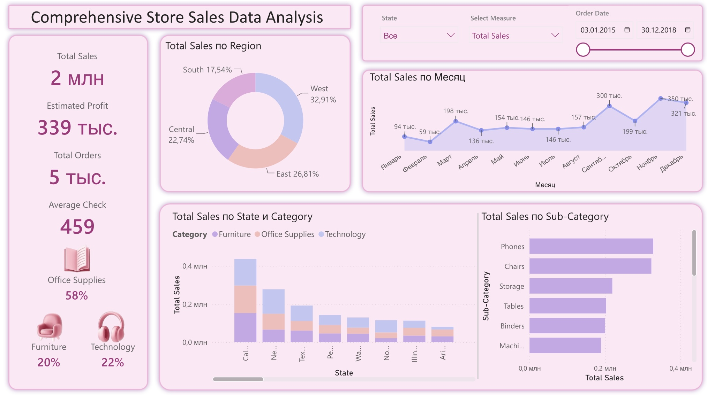

# Project-1-Power-BI-

Retail Sales Dashboard (Power BI)

**Описание проекта**

Интерактивный аналитический дашборд, разработанный в Power BI для анализа продаж сети магазинов.
Цель проекта — предоставить единый инструмент для мониторинга ключевых показателей эффективности (KPI), анализа продаж по регионам, штатам, категориям и подкатегориям товаров, а также оценки динамики продаж во времени.
Проект демонстрирует навыки работы с Power BI, моделирования данных, создания вычисляемых мер на DAX и разработки интерактивной аналитической отчетности.

__Проблема__

Руководству сети магазинов необходим единый инструмент для анализа эффективности продаж по различным направлениям бизнеса (география, ассортимент, временные периоды) и различным ключевым показателям эффективности (KPI).
Использование отдельных отчетов для каждого показателя усложняет анализ, затрудняет сравнение результатов и увеличивает время поиска необходимой информации. 

**Решение**

Разработан интерактивный дашборд с динамическим выбором KPI, позволяющий проводить многомерный анализ в рамках одного отчета. Ключевой особенностью проекта является использование Field Parameters для динамического выбора KPI. Пользователь может переключаться между различными показателями эффективности, при этом все визуализации автоматически обновляются без необходимости создавать отдельные страницы или дублировать графики. Такой подход делает отчет более гибким, удобным и позволяет проводить многомерный анализ данных.

**Используемые данные**

В проекте использован набор данных Superstore, содержащий информацию о:
- продажах;
- заказах;
- клиентах;
- товарах;
- категориях и подкатегориях товаров;
- географии продаж;
- датах заказов.

**Возможности дашборда**

Дашборд позволяет:
- анализировать продажи по регионам и штатам;
- сравнивать категории и подкатегории товаров;
- отслеживать динамику продаж во времени;
- анализировать ключевые показатели эффективности;
- использовать интерактивные срезы для фильтрации данных;
- переключаться между различными KPI без изменения структуры отчета.

**Реализованные KPI**

В проекте рассчитаны следующие показатели:
- Total Sales — общая сумма продаж;
- Average Check — средний чек;
- Total Orders — количество заказов;
- Estimated Profit - ожидаемая прибыль;
- Total Sold — количество проданных товаров.

Все визуализации построены на основе Field Parameters, благодаря чему выбранный показатель автоматически применяется ко всем графикам и диаграммам. 

**Используемые технологии**
- Power BI Desktop
- Power Query
- DAX
- Field Parameters
- Data Modeling
- Interactive Visualizations

**Продемонстрированные навыки**
- подготовка и преобразование данных в Power Query;
- моделирование данных;
- создание вычисляемых мер на DAX;
- использование Field Parameters;
- разработка интерактивных визуализаций;
- применение срезов и перекрестной фильтрации;
- проектирование аналитических дашбордов.

**Предварительный просмотр**

**Главная страница**

**Демонстрация динамического переключения KPI с использованием Field Parameters**

**Онлайн-версия**

Интерактивная версия дашборда доступна по ссылке: https://app.powerbi.com/links/gCUKodId1_?ctid=423ab8f4-e16c-4fb8-ab9d-caac34ad9fbb&pbi_source=linkShare&bookmarkGuid=84dec799-fe0d-4668-adbb-3ddea371ae7c

**Вывод**

В рамках проекта разработан интерактивный аналитический дашборд для анализа продаж сети магазинов. Использование Field Parameters позволило реализовать динамический выбор КРІ и обеспечить многомерный анализ
данных в рамках одного отчета. Проект демонстрирует практические навыки работы с Power BI, DAX, моделирования данных и разработки интерактивных Bl-решений.
