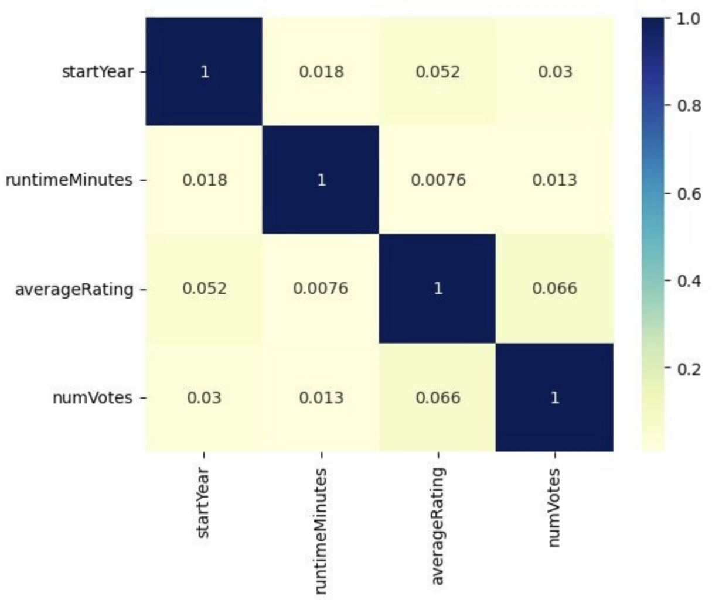
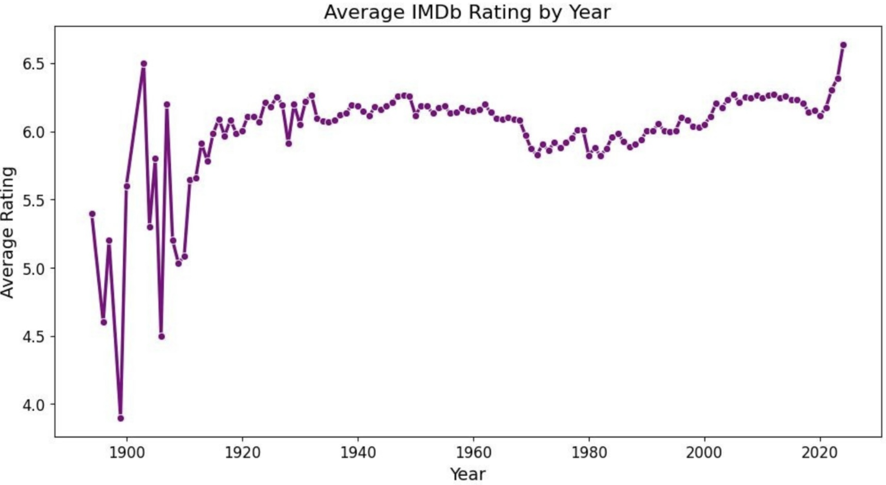

# Анализ факторов, влияющих на рейтинг фильмов IMDb

**О проекте**

Рейтинги фильмов являются одним из ключевых показателей их восприятия аудиторией. Однако на итоговую оценку влияет множество факторов: год выхода, продолжительность, жанр, популярность фильма и другие характеристики.
В данном проекте проведен комплексный анализ данных IMDb с целью выявления факторов, связанных с рейтингом фильмов, проверки статистических гипотез и построения моделей машинного обучения для прогнозирования категории рейтинга.

**Проблема**

Киноиндустрия ежегодно выпускает тысячи фильмов, однако заранее оценить их потенциальное восприятие зрителями достаточно сложно. Возникает вопрос: какие характеристики фильма действительно связаны с его рейтингом и можно ли предсказать уровень оценки, используя только доступные метаданные?
Ответ на этот вопрос может быть полезен для исследования предпочтений аудитории и построения рекомендательных и аналитических систем.

**Решение**

Для решения задачи был реализован полный аналитический цикл:
- проведена очистка и объединение данных IMDb;
- выполнен описательный анализ данных (EDA);
- исследованы зависимости между рейтингом и характеристиками фильмов;
- проверены статистические гипотезы;
- построены модели машинного обучения для классификации рейтинга;
- проведено сравнение качества моделей и интерпретация результатов.

**Используемые данные**

Источник данных — IMDb Non-Commercial Datasets.

В анализ были включены следующие характеристики:
- год выхода фильма;
- длительность;
- жанры;
- средний рейтинг IMDb;
- количество пользовательских оценок;
- возрастное ограничение;
- информация о режиссерах и сценаристах.

**Этапы работы**

1. Предобработка данных
- очистка данных;
- удаление пропусков и дубликатов;
- преобразование признаков;
- создание новых переменных для анализа и моделирования.

2. Разведочный анализ данных (EDA)

Проведен анализ:

- распределения жанров;
- изменения среднего рейтинга по годам;
- зависимости рейтинга от количества оценок;
- описательных статистик;
- корреляций между признаками.

Тепловая карта корреляций: Между всеми признаками наблюдается очень слабая корреляция (коэффициенты близки к нулю). Это говорит об отсутствии значимой линейной зависимости между ними.

Средний рейтинг по годам: После 1920-х годов средний рейтинг остается относительно стабильным на уровне около 6 баллов. В последние годы заметен небольшой рост среднего рейтинга.

3. Проверка гипотез

Были проверены три гипотезы:
- старые фильмы имеют более низкий рейтинг;
- более длинные фильмы получают более высокие оценки;
- фильмы с большим количеством оценок имеют более высокий средний рейтинг.

4. Машинное обучение

Для прогнозирования рейтинга фильма:
- рейтинг был преобразован из 10-балльной шкалы в 5 категорий;
- построена мультиномиальная логистическая регрессия;
- обучены модели Decision Tree и Random Forest;
- выполнено сравнение качества моделей.

**Проверка гипотез**

| Гипотеза | Вывод |
|----------|--------|
| С увеличением возраста фильма средний рейтинг снижается. | ❌ Не подтвердилась. Выраженной зависимости между годом выпуска и рейтингом не выявлено. |
| Чем больше длительность фильма, тем выше его рейтинг. | ❌ Не подтвердилась. Продолжительность фильма не оказывает существенного влияния на рейтинг. |
| Фильмы с большим количеством пользовательских оценок имеют более высокий средний рейтинг. | ✅ Подтвердилась. Более популярные фильмы, как правило, получают более высокие оценки пользователей. |

**Основные результаты**

- Средний рейтинг фильмов остается относительно стабильным независимо от года выпуска.
- Более популярные фильмы получают значительно больше пользовательских оценок.
- Наилучшее качество классификации показал Random Forest, однако точность моделей остается умеренной, что свидетельствует о влиянии множества факторов, отсутствующих в датасете (сюжет, актерский состав, качество сценария, маркетинг и др.).

**Использованные технологии:**
- Python
- Pandas
- NumPy
- Matplotlib
- Seaborn
- Scikit-learn
- Statsmodels

**Навыки, продемонстрированные в проекте:**

- очистка и подготовка данных;
- исследовательский анализ данных (EDA);
- визуализация данных;
- статистический анализ и проверка гипотез;
- построение и интерпретация логистической регрессии;
- построение моделей Decision Tree и Random Forest;
- оценка качества моделей;
- интерпретация результатов и формулирование аналитических выводов.
